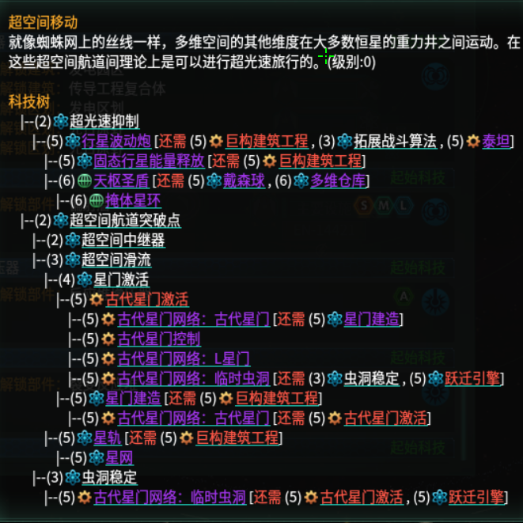

# Dynamic Technology Tree（Stellaris 科技树本地化生成器）



这是一个 Python 3.10+ 的生成器：扫描 Stellaris 的科技定义与本地化文件，然后输出 Stellaris 可读取的本地化 `.yml` 文件，在游戏内展示格式化后的“科技树”字符串。

本仓库是 **Dynamic Technology Tree** MOD 所使用的生成工具。

## 项目概览

- **运行环境**：Python **3.10+**（见 `pyproject.toml`）。
- **主要使用方式**：**PyQt6** 图形界面（GUI，唯一支持的使用方式）。
- **核心流水线**：`TechTreeGenerator`（`src/generator.py`）。
- **输出位置**：默认写到当前工作目录下的 `localisation/`（见 `src/dtt_core/output.py`）。
- **目标 Stellaris 版本**：`v4.2.*`（见 `descriptor.mod`）。

## 功能特性

- 扫描本体 `.../common/technology`，并合并已启用 MOD 的科技（Steam 创意工坊 + 本地 MOD）。
- 扫描 `localisation` 中的科技描述，生成每个科技对应的“科技树”字符串。
- 渲染时支持显示限制（最大深度/每节点最大子节点/最大展示节点数）。
- 输出多个 Stellaris 兼容目录布局的本地化文件（包含 `replace` 变体），编码为 UTF-8 BOM（`utf-8-sig`）。
- 提供 GUI：编辑 `config.ini`、自动检测常见 Stellaris 路径、后台生成并实时输出日志。

## 快速开始（GUI）

1) 以可编辑模式安装（包含 GUI 依赖）：

```bash
python -m pip install -e .
```

2) 在仓库根目录创建 `config.ini`（示例见下文）。

3) 启动 GUI：

```bash
dtt-gui
```

4) 点击生成。输出文件会出现在 `./localisation/` 下。

## 安装

本项目使用 `src/` 目录结构，并通过 `setuptools` 打包（见 `pyproject.toml`）。

```bash
# 安装（包含 GUI）
python -m pip install -e .

# 开发安装（测试）
python -m pip install -e ".[dev]"
```

## 运行 GUI

### 已安装的入口（推荐）

入口脚本在 `pyproject.toml` 中定义（`[project.gui-scripts]`）：

- `dtt-gui = "gui:main"`

运行：

```bash
dtt-gui
```

## 配置（`config.ini`）

生成器使用 Python `configparser` 读取配置（`src/dtt_core/config_loader.py`）。

### 必需的段/键

`[paths]`：

- `base_game_path`（必填）：Stellaris 本体安装根目录。
- `mod_folder_path`（必填）：Steam 创意工坊 MOD 目录（Steam app id 为 `281990`）。
- `local_mod_folder_path`（可选）：本地 MOD 根目录。
- `dlc_load_path`（可选）：`dlc_load.json` 路径（用于识别“已启用 MOD”列表）。

`[localization]`：

- 段必需；`language` 键可选（缺失时使用默认值）。
- `priority_mods`（可选）：逗号分隔的 MOD ID 列表，用于优先选择本地化来源。

`[display]`（可选）：

- `max_children_per_node`（int）
- `max_tree_depth`（int）
- `max_display_nodes`（int）

### 最小示例

请按你的机器实际路径修改：

```ini
[paths]
base_game_path = /path/to/Stellaris
mod_folder_path = /path/to/Steam/steamapps/workshop/content/281990
local_mod_folder_path =
dlc_load_path =

[localization]
language = english

[display]
max_children_per_node = 12
max_tree_depth = 4
max_display_nodes = 128
```

### 关于 `dlc_load_path`

- 在 **Windows** 上，如果 `dlc_load_path` 为空，生成器会默认使用 `~/Documents/Paradox Interactive/Stellaris/dlc_load.json`（见 `src/dtt_core/config_loader.py`）。
- 在 **非 Windows** 上，如果 `dlc_load_path` 为空，生成器会打印提示并继续执行（但不会做已启用 MOD 识别）。

## 输出

生成过程会把本地化输出写到相对路径 `localisation/` 下（相对于进程当前工作目录，见 `src/dtt_core/output.py`）。

每种目标语言会生成两类主要文件：

- `zztechtreemain_l_<lang>.yml`：包含每个科技的“科技树”字符串（例如 `tech_id_techtree`）。
- `zztechtreereplaced_l_<lang>.yml`：包含 `*_desc` 的替换条目，会把科技树字符串与层级信息追加到描述后。

为兼容 Stellaris 不同的加载目录布局，生成器会把相同内容写到多个候选路径（自动创建父目录）：

- `localisation/<file>`
- `localisation/<lang>/<file>`
- `localisation/replace/<file>`
- `localisation/<lang>/replace/<file>`
- `localisation/zzz_tech_trees/replace/<file>`

文件编码为 UTF-8 BOM（`utf-8-sig`）。生成的 `localisation/` 目录已在 `.gitignore` 中忽略。

## 开发

### 测试

Pytest 配置在 `pyproject.toml` 中，测试位于 `tests/`：

```bash
python -m pytest
```

### 类型检查

`pyproject.toml` 中存在 `pyright` 配置块，但 `dev` extra 并未安装 `pyright`。

## Windows 打包

Windows `.exe` **必须在 Windows 上构建**（PyInstaller 不支持可靠的跨平台打包）。

在 Windows（PowerShell）中：

1) 创建并激活虚拟环境，安装依赖：

```powershell
python -m venv .venv
.\.venv\Scripts\Activate.ps1
python -m pip install -e .
python -m pip install pyinstaller
```

2) 使用项目的 canonical spec 生成 EXE（入口为 `src/gui/__main__.py`）：

```powershell
pyinstaller packaging/pyinstaller/techtree_gui.spec
```

输出：`dist/`（已在 `.gitignore` 中忽略）。

## 常见问题（FAQ）

### “Error: required configuration entries missing ...”

你的 `config.ini` 在 `[paths]` 下缺少必填项（至少需要 `base_game_path` 与 `mod_folder_path`）。

### GUI 能启动，但没有输出文件

- 输出是相对于进程工作目录写入的（例如 `./localisation`）。GUI 会尝试 `chdir` 到其解析出的应用根目录（见 `src/gui/__init__.py`）。
- 请在你启动时所在目录（或 EXE 所在目录）查找是否生成了 `localisation/` 文件夹。

### 识别不到已启用 MOD

- 已启用 MOD 的识别依赖 `dlc_load.json`（在 `config.ini` 中设置 `dlc_load_path`）。
- 在非 Windows 系统上没有默认 `dlc_load.json` 路径，需要手动配置。

### “ModuleNotFoundError: No module named 'PyQt6'”

PyQt6 是必需依赖。请确保你通过 `pip` 安装了本项目（会自动拉取 PyQt6）：

```bash
python -m pip install -e .
```
